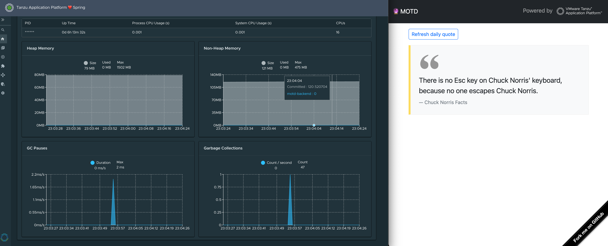
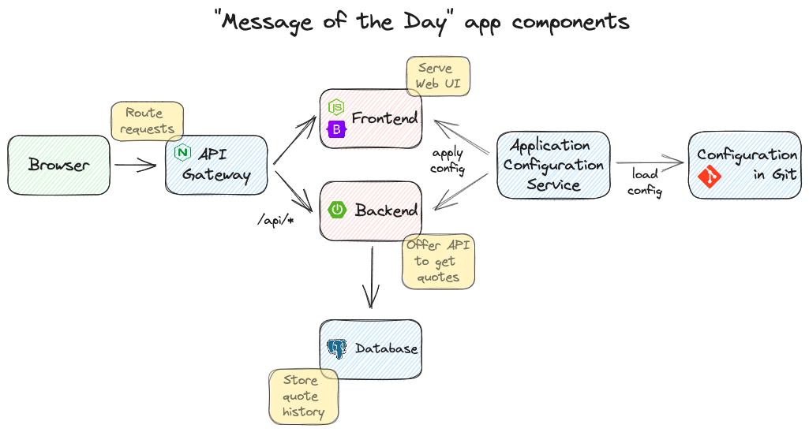
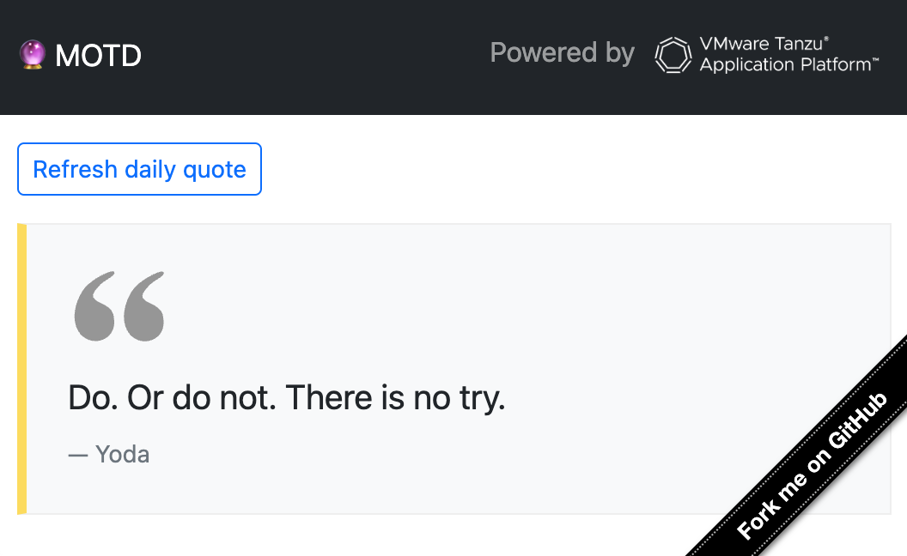
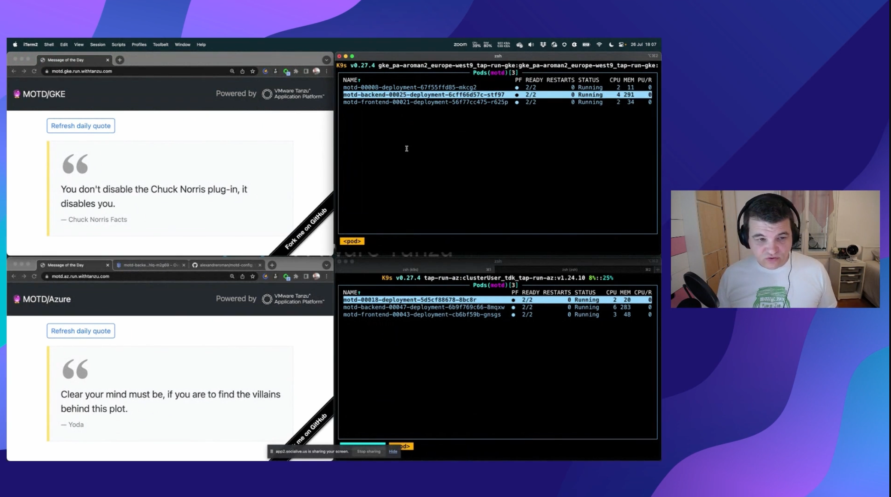

# Message of the Day

Welcome to *Message of the Day*, your source for famous quotes!



This demo app is designed to run on
[VMware Tanzu Application Platform](https://tanzu.vmware.com/application-platform),
the best way to simplify your Kubernetes developer experience.

If you want to see this app in action, head over to the SpringOne 2023 session:
[Power up your applications with Service Bindings and Bitnami](https://springone.io/sessions/power-up-your-applications-with-service-bindings-and-bitnami).


## Architecture



This app is made of several components:

- [a frontend](https://github.com/alexandreroman/motd-frontend) serving a Web UI powered by NodeJS, Express and Bootstrap
- [a backend](https://github.com/alexandreroman/motd-backend) component providing a REST API, powered by Spring Boot
- [a Git-backed configuration](https://github.com/alexandreroman/motd-config)
- an API gateway routing traffic between components, powered by nginx (find the implementation in this repository).

This app relies on Tanzu Application Platform to provide additional services:

- a PostgreSQL database instance (use Bitnami or any PostgreSQL compatible instance)
- Application Configuration Service, a service which is responsible for loading the app configuration from a Git repository as Kubernetes `Secret` entities (the app components are automatically restarted whenever you update the configuration)
- scale-to-zero for app components powered by Knative (pods are shutdown if you don't use the app)

## Running this component on your workstation

Head over to the [backend](https://github.com/alexandreroman/motd-backend)
and [frontend](https://github.com/alexandreroman/motd-frontend)
Git repositories for more details.

This repository contains the implementation for the nginx container,
which is responsible for routing traffic between the frontend and the backend.

Use this command to run nginx on your workstation:

```shell
nginx -c $PWD/local/nginx.conf
```

Run the frontend in local mode:

```shell
cd <motd-frontend>
npm i; npm start
```

Run the backend in local mode:

```shell
cd <motd-backend>
mvn spring-boot:run -Dspring-boot.run.profiles=dev
```

Now hit http://127.0.0.1:9000 in your browser:



## Deploying with VMware Tanzu Application Platform

> [!WARNING]
> The nginx container relies on the
> [Downward API](https://knative.dev/docs/serving/configuration/feature-flags/#kubernetes-downward-api)
> from Knative Serving:
> you need to enable this feature in your platform configuration.

In fact, the workload takes care of redirecting the inbound traffic to the
app components using the in-cluster Knative URL. This URL depends on the Kubernetes
namespace by default. When the Downward API is enabled in Knative Serving,
the nginx container can use this API to get the namespace dynamically.

If you cannot enable the Downward API on your Tanzu Application Platform installation
for some reason, you can still use this app: just edit the
[workload definition](config/workload.yaml) and set the namespace in the
environment variable `MOTD_NAMESPACE`.

Use this command to deploy the nginx component to your favorite Kubernetes cluster:

```shell
tanzu apps workload apply -f config/workload.yaml
```

Proceed the same way for the other app components.

The platform will take care of building, testing and deploying app components.

Run this command to get deployment status:

```shell
tanzu apps workload get motd-frontend
```

Enjoy!

## See this app in action!

This app was showcased during the SpringOne 2023 session:
`Power up your applications with Service Bindings and Bitnami`.



In this session you will learn how to use
[servicebinding.io](https://servicebinding.io):
an open source Kubernetes specification standardizing access to services from workloads.
[Spring Cloud Bindings](https://github.com/spring-cloud/spring-cloud-bindings)
fills the gap between servicebinding.io and your Spring Boot app,
by mapping service binding configuration attributes to Spring configuration properties.

Combined with [Bitnami](https://bitnami.com/), you get a tremendous productivity boost:
create new databases / message brokers / etc on demand thanks to
VMware Tanzu Application Platform, without having to deal with service credentials!

If you have any question, please feel free to reach out.
